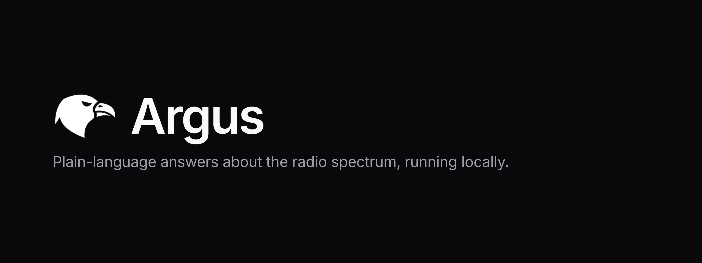
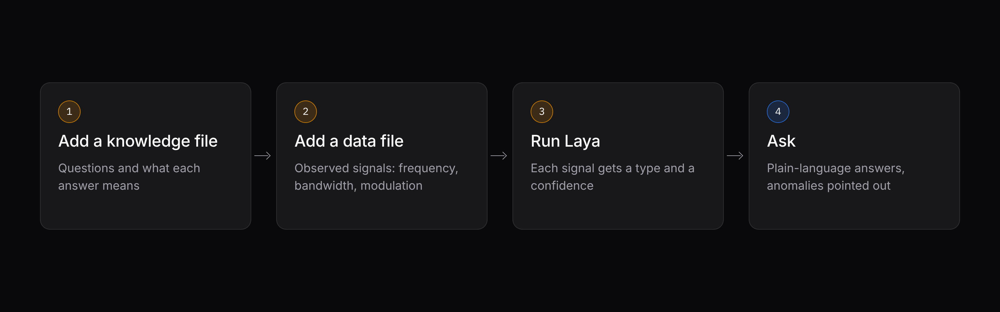
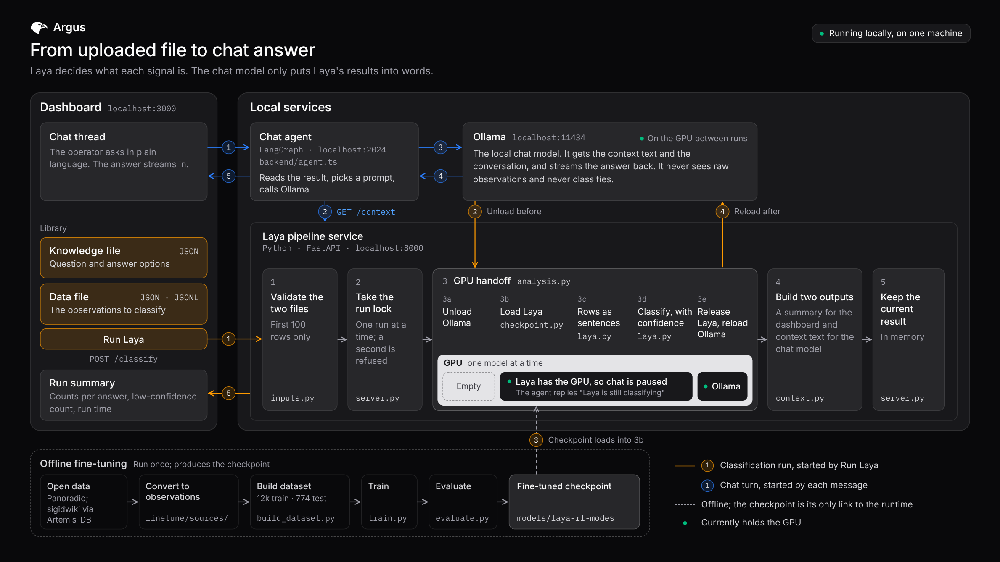

# Argus



Argus tells a radio operator who is not an RF expert what signals are in a capture, in plain language, on their own machine. They upload a list of observed signals, a fine-tuned model names each one, and a local chat answers questions about the result and points out the ones that look wrong.

Built at SprintHack@ND by Gabriel Marques and José Lima. Everything runs on one computer, with no cloud service.

| Read | For |
|---|---|
| [documentation/document.md](documentation/document.md) | The full project write-up: the problem, how Argus answers it, results, limits and a pilot plan |
| [documents/local-setup.md](documents/local-setup.md) | Step-by-step setup on a new machine, with troubleshooting |
| [frontend/README.md](frontend/README.md) | The dashboard and the chat agent |
| [finetune/README.md](finetune/README.md) | How the checkpoint is trained and evaluated |

## What it does



1. **Add a knowledge file.** It holds the question to ask about every signal and a one-line description of each possible answer. This is where the RF expertise lives, written once by someone who has it.
2. **Add a data file.** A list of observed signals, each with a centre frequency, a bandwidth and a modulation.
3. **Press Run Laya.** A fine-tuned [Laya](https://github.com/NandhaKishorM/laya) model reads each observation and picks one of the answers, with a confidence.
4. **Ask.** A local chat model answers questions such as "Summarize the classification" or "Report anomalies and low-confidence signals", using only what the classifier found.

## Quick start

You need Python 3.12, Node 22, [Ollama](https://ollama.com) running, and the fine-tuned checkpoint in `models/laya-rf-modes` at the repository root. The checkpoint is about 800 MB and is not committed: train it with [finetune/README.md](finetune/README.md), or copy the folder from the machine that did.

```bash
# from the repository root
python3.12 -m venv .venv
.venv/bin/pip install -r requirements.txt
ollama pull qwen2.5:14b

cd frontend
cp .env.example .env.local
npm install
npm run dev
```

Then open <http://localhost:3000>. `npm run dev` starts the web app, the chat agent and the Laya service together.

In the Library:

1. Under **Knowledge**, add [data/data-full.json](data/data-full.json).
2. Under **Data**, add [data/observations-full.jsonl](data/observations-full.jsonl).
3. Press **Run Laya**. The chat is paused while the classifier runs.
4. When the Library shows **Active**, ask the chat what it found.

The first 100 rows are classified. Ask the chat to analyze the remaining rows, or a different number, and it runs Laya on that slice and summarizes it. **Clear**, or removing a file the result came from, drops the result.

## Input files

**A data file** is a JSON list of objects, or one object per line (JSONL):

```json
[
  {"center_frequency_hz": 14070000, "bandwidth_hz": 60, "modulation": "PSK"},
  {"center_frequency_hz": 518000, "bandwidth_hz": 250, "modulation": "FSK"},
  {"center_frequency_hz": 2437000000, "bandwidth_hz": 20000000, "modulation": "OFDM"}
]
```

- Each row needs `center_frequency_hz` and `bandwidth_hz` (numbers, in Hz) and `modulation` (text; `"unknown"` is accepted).
- `id` is optional and defaults to the row number. Other fields are ignored by the classifier.
- Up to 2 MB per file.

**A knowledge file** is one JSON object of questions. Each question has `"type": "choice"`, `instructions` as text, and `criteria` with at least two answers and a description of each, as in [data/data-full.json](data/data-full.json). The model was fine-tuned on that one question; other questions run, but how well it answers them has not been measured.

Several files can be selected in each tab. Data files are joined in order. Knowledge files are merged, so one question can be split across files, as in [data/data_1.json](data/data_1.json) and [data/data_2.json](data/data_2.json).

A file that does not fit is refused with a message that names the file and the row or question at fault, for example `Row 3 is missing bandwidth_hz.`

## How it works



Orange arrows are a classification run. Blue arrows are a chat turn. The dashed strip is the offline fine-tuning; the checkpoint is its only link to the running app.

| Process | Address | Job |
|---|---|---|
| Next.js app | `localhost:3000` | The page: the Library and the chat. Forwards file uploads to the Laya service |
| LangGraph agent | `localhost:2024` | Builds each chat turn ([frontend/backend/agent.ts](frontend/backend/agent.ts)) |
| Laya service | `localhost:8000` | Checks the files, runs the classifier, keeps the current result ([pipeline/server.py](pipeline/server.py)) |
| Ollama | `localhost:11434` | Runs the chat model |

**A run.** The service checks both files, then rewrites each observation as one sentence in the same words the answer descriptions use, such as `shortwave (HF) band, centered at 14.1 MHz, 349 Hz wide, MFSK modulation.` Laya reads that sentence next to the question and its options and returns one option and a confidence.

**Sharing the GPU.** Laya and the chat model do not both fit on a small GPU, so they take turns. The service unloads the chat model, loads Laya, classifies every row in one batch, then releases Laya and reloads the chat model. Laya uses CUDA when at least 2 GiB of GPU memory is free, otherwise Apple MPS, otherwise CPU. On a 4 GB GPU, 100 observations take about 5 seconds to classify, and reloading Ollama takes 4 to 30 seconds.

**A chat turn.** On every message the agent asks the service for the current result and puts it in the system prompt, so a new run is picked up by the next message. If nothing has been run, or the service is down, the model is told to say so and not to invent signals.

**What the chat model is given.** Not the rows. A small model miscounts long lists, so the service does the counting and hands over, per question: what each answer means, the count and observation ids per answer, the mean and lowest confidence, and the 20 least certain observations under 0.5 confidence with their measurements.

### The Laya service

`npm run dev` starts it. To run it by itself:

```bash
python -m uvicorn pipeline.server:app --host 127.0.0.1 --port 8000
```

| Request | What it does |
|---|---|
| `POST /classify` | Takes `{"knowledge": {"name", "text"}, "data": {"name", "text"}}`, where each side can also be a list of files. Runs Laya on the first 100 rows and makes the result the current one |
| `POST /reclassify` | Takes `{"count"?, "remaining"?}` and runs Laya again on the files from the last `/classify`. `remaining` starts after the current result; a `count` is how many rows, from the start unless `remaining` is set |
| `GET /context` | The current result as the text the chat model answers from, and whether a run is in progress |
| `DELETE /context` | Forgets the current result and the stored files |
| `GET /health` | Answers `{"status": "ok"}` |

One result is kept at a time, in memory. A second run started while one is going is refused.

## Configuration

| Setting | Where | Default |
|---|---|---|
| Laya checkpoint | `LAYA_CHECKPOINT` environment variable (a Hugging Face id or a local folder) | `models/laya-rf-modes` in this repository |
| Chat model | `OLLAMA_MODEL`, in the shell and in `frontend/.env.local` | `qwen2.5:14b` |
| Ollama address | `OLLAMA_HOST`, in the shell and in `frontend/.env.local` | `http://127.0.0.1:11434` |
| Chat context window | `OLLAMA_NUM_CTX` in `frontend/.env.local` | Ollama's default |
| Laya service address | `PIPELINE_API_URL` in `frontend/.env.local` | `http://127.0.0.1:8000` |
| Observations per run | `MAX_OBSERVATIONS` in `pipeline/inputs.py` | 100 |

The Laya service and the chat agent must name the same chat model, because the service keeps that one loaded and a small GPU cannot hold a second. The model has to support tool calling, which the chat uses to classify another slice of rows. `qwen3:4b` (without `-instruct`) reasons at length and runs out of tokens before it answers.

## The model

Laya is asked one question: which signal type is this observation? There are nine answers. Eight are shortwave signal types, and `other` is everything else.

| Answer | Covers | Test rows |
|---|---|---|
| `morse` | Morse code (CW) | 48 |
| `psk` | PSK31, PSK63, QPSK31 | 144 |
| `rtty` | Radioteletype, 45 baud, 170 Hz shift | 48 |
| `olivia` | Olivia 8/250, 16/500, 16/1000, 32/1000 | 192 |
| `dominoex` | DominoEX 11 | 48 |
| `mt63` | MT63-1000 | 48 |
| `navtex` | NAVTEX marine broadcast (SITOR-B) | 48 |
| `weather_fax` | HF weather fax | 48 |
| `other` | Catalogued signals from sigidwiki | 150 |
| Total | | 774 |

In the committed knowledge files the Morse answer is named `enemy`, a rename made for the demo.

Fine-tuned Laya scores **91.6%** on the 774 held-out rows. A nearest-neighbour lookup on the same three fields scores 82.7%, which shows how much of the task is easy.

Read that number with two things in mind:

- **Only the bandwidth of a Panoradio row is measured.** The recordings carry no centre frequency, so the converter places each one on a frequency where its mode is really operated, and writes the modulation name from the mode. A high score therefore partly shows the model recovering those assignment rules. It is not evidence that the model recognises these signals off the air.
- **The eight named types are tested on held-out rows of the same recordings set.** Only `other` is tested on signal types absent from training.

Training takes hours and is done beforehand. The steps, the data sources and the earlier runs are in [finetune/README.md](finetune/README.md) and in [the write-up](documentation/document.md#7-the-model).

## Data

| File | What is there |
|---|---|
| [data/data-full.json](data/data-full.json) | The knowledge file: the question Laya answers, with one description per signal type |
| [data/data_1.json](data/data_1.json), [data/data_2.json](data/data_2.json) | The same question split across two knowledge files |
| [data/observations-full.jsonl](data/observations-full.jsonl) | The 774 observations set aside from the training data, each with a centre frequency, bandwidth, modulation, SNR and the expected `label_mode` |
| [data/observations_1.jsonl](data/observations_1.jsonl), [data/observations_2.jsonl](data/observations_2.jsonl) | The same observations split across two data files |
| [data/train/](data/train/) | Observations built from two public sources, [Panoradio HF](https://panoradio-sdr.de/radio-signal-classification-dataset/) and [Artemis-DB](https://github.com/AresValley/Artemis-DB) (an export of sigidwiki.com) |

The licence terms of the Panoradio HF dataset and of the sigidwiki data have not been confirmed. Check before publishing anything built on them.

## Command line and tests

The same classification runs from a terminal, without the dashboard:

```bash
source .venv/bin/activate
python -m pipeline "How many weather fax signals were seen?"
```

Each observation is printed as one JSON object with the signal type Laya chose and its confidence, then the Ollama answer in green, then a reference line showing how many of Laya's labels match `label_mode`. Step timings go to stderr. With no argument the question is "Which observations are Morse code, and how many are not?".

The tests cover file checking, the text built for the chat model, checkpoint selection and the HTTP service. They do not load Laya or call Ollama.

```bash
pip install -r requirements-dev.txt
python -m pytest tests
```

The command-line run, the tests and the scripts in `finetune/` still read the sample files under their earlier names, `data/questions_20.json` and `data/test_observations.jsonl`. Those are now `data/data-full.json` and `data/observations-full.jsonl`.

## Limits

- The app classifies 100 rows of a file per run; the rest are classified on request from the chat.
- One result is kept at a time, in memory. It survives a page reload but not a restart of the Laya service.
- One run at a time, one operator.
- The model sees three fields as text. It has not been validated on signals captured off the air.
- The app does not read a live SDR, a raw IQ file or a spectrogram image. Bandwidth is measured from IQ samples only offline, in [finetune/sources/panoradio.py](finetune/sources/panoradio.py), to build the training data.
- Anomalies are low-confidence observations and rare answers, nothing more.

## Repository map

| Path | What is there |
|---|---|
| [pipeline/](pipeline/) | The classifier wrapper, file checks, chat context and the HTTP service |
| [frontend/](frontend/) | The dashboard: Library, chat, the LangGraph agent and the proxies |
| [finetune/](finetune/) | Data converters, dataset builder, training and evaluation scripts |
| [data/](data/) | The knowledge files, the 774 test observations and the training observations |
| [tests/](tests/) | Tests for file checking, the chat context, checkpoint selection and the HTTP service |
| [documentation/](documentation/) | The project write-up and its figures |
| [documents/](documents/) | The local setup guide |
