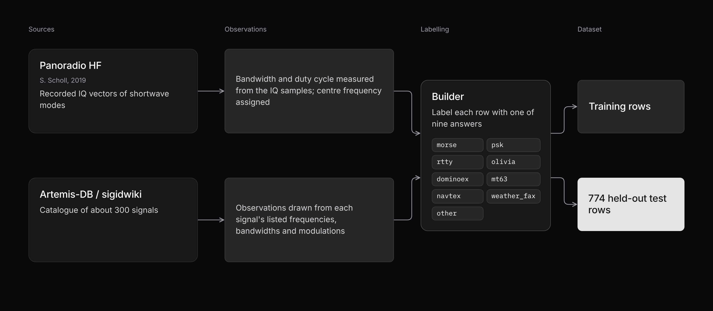
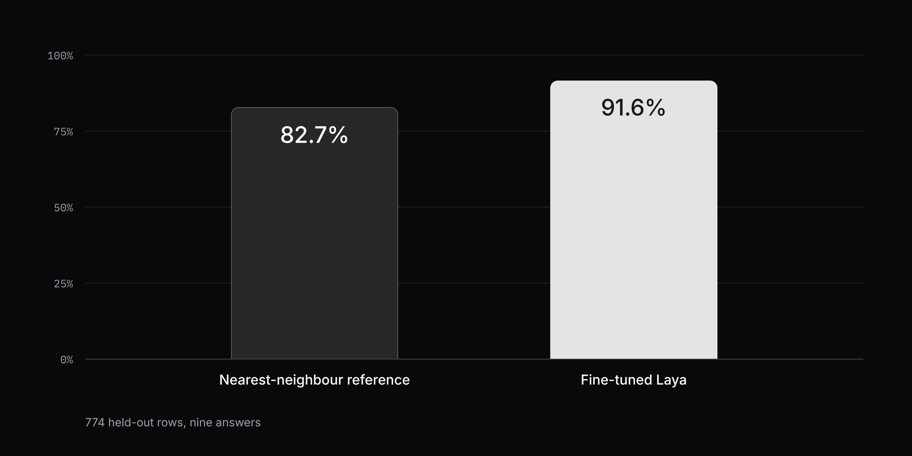
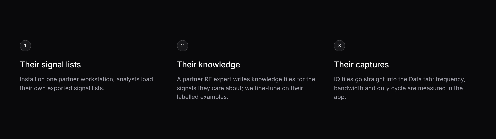

# Argus

**Argus tells a radio operator who is not an RF expert what signals are in a capture, in plain language, on their own machine: they upload a list of observed signals, a fine-tuned model names each one, and a local chat answers questions about the result and points out the ones that look wrong.**


| | |
|---|---|
| Event | SprintHack@ND |
| Team | Gabriel Marques, José Lima |
| Repository | <https://github.com/jlimaz/undefined-sprint-hack> |
| Runs on | One computer, with no cloud service |

## Where to find each judging criterion

| Criterion | Points | Read |
|---|---|---|
| Working Evidence | 26 | [3. Try it with your own example](#3-try-it-with-your-own-example) |
| Partner Problem Fit | 22 | [4. How it answers the track statement](#4-how-it-answers-the-track-statement) |
| Fits Their Constraints | 19 | [5. The limits the track set](#5-the-limits-the-track-set) |
| Technical Substance | 15 | [6. How it works](#6-how-it-works), [7. The model](#7-the-model), [8. What is real and what is not](#8-what-is-real-and-what-is-not) |
| Demo Clarity | 11 | The first line of this page, and [2. What Argus does](#2-what-argus-does) |
| X-Factor | 7 | [10. What a pilot would look like](#10-what-a-pilot-would-look-like) |

## 1. The problem

The track statement, in brief:

> Pair software-defined radio output with AI to identify signals, explain a spectrum in plain language, and flag anomalies. No radios in the building; work from public capture sets or your own equipment.

And in full:

> Commercial software-defined radios have made it easy to capture raw RF signals, but turning that data into useful insight still requires deep domain expertise most users don't have. This track asks teams to pair SDR output with LLMs or multimodal AI to automatically characterize signal metadata (frequency, bandwidth, modulation), translate complex spectral visualizations into plain-language summaries, and flag anomalies in the ambient spectrum. All solutions must rely on open-source, publicly documented tools and protocols.

The person we built for has a capture and a list of what was seen in it: a frequency, a width and a modulation per signal. They cannot tell from those numbers whether a row is Morse code, a weather fax or something that should not be there.

## 2. What Argus does

Four steps, all in one browser page:

1. **Add a knowledge file.** It holds the question to ask about every signal and a one-line description of each possible answer. This is where the RF expertise lives, written once by someone who has it.
2. **Add a data file.** A list of observed signals, each with a centre frequency, a bandwidth and a modulation.
3. **Press Run Laya.** A fine-tuned model reads each observation and picks one of the answers, with a confidence.
4. **Ask.** A local chat model answers questions such as "Summarize the classification" or "Report anomalies and low-confidence signals", using only what the classifier found.


## 3. Try it with your own example

### What runs live

| Step | Runs live, end to end | Notes |
|---|---|---|
| Checking a file as it is added | Yes | A file that is not valid JSON, or is in the wrong tab, says so under its name and cannot be picked |
| Classifying the observations | Yes | The fine-tuned model runs on this machine. The first 100 rows of the file are classified |
| Chat grounded in the result | Yes | The chat model runs on this machine through Ollama |
| The same run from a terminal | Yes | `python -m pipeline "your question"` |
| Fine-tuning the model | No, done beforehand | About 8 hours; the result is a checkpoint folder the app loads |
| Measuring bandwidth from raw IQ samples | No, done beforehand | Used to build the training and test data, not part of the live app |

Nothing in the live path is recorded or mocked.

### Entering your own input

Save this as `my_signals.json`, change the numbers to anything you like, and add it in the Library under **Data**:

```json
[
  {"center_frequency_hz": 14070000, "bandwidth_hz": 60, "modulation": "PSK"},
  {"center_frequency_hz": 518000, "bandwidth_hz": 250, "modulation": "FSK"},
  {"center_frequency_hz": 2437000000, "bandwidth_hz": 20000000, "modulation": "OFDM"}
]
```

The three rows are written to look like a PSK keyboard signal on the 20 metre amateur band, a NAVTEX marine broadcast, and a Wi-Fi channel, which none of the eight named signal types covers. Then:

1. Under **Knowledge**, add [data/questions_20.json](../data/questions_20.json).
2. Press **Run Laya**. The chat is paused while the classifier runs.
3. When the Library shows **Active**, ask the chat what it found.

Rules for a data file:

- A JSON list of objects, or one object per line (JSONL), as in [data/test_observations.jsonl](../data/test_observations.jsonl).
- Each row needs `center_frequency_hz` and `bandwidth_hz` (numbers, in Hz) and `modulation` (text; `"unknown"` is accepted).
- `id` is optional and defaults to the row number. Other fields are ignored by the classifier.
- Up to 2 MB per file. Only the first 100 rows are classified, and the chat is told when rows were left out.

You can also bring your own questions. A knowledge file is one JSON object of questions, each with `"type": "choice"`, `instructions` as text, and `criteria` with at least two answers and a description of each. The model was fine-tuned on the one question in `data/questions_20.json`; other questions run, but we have not measured how well it answers them.

### When the input is wrong

A file that does not fit is refused with a message that names the file and the row or question at fault, for example `Row 3 is missing bandwidth_hz.` or `This looks like a knowledge file. A data file is a list of observations.`

## 4. How it answers the track statement

| What the statement asks | What Argus does | Status |
|---|---|---|
| "Pair SDR output with LLMs or multimodal AI" | Two models in sequence: Laya, a small classifier we fine-tuned, names each observation; a local LLM explains the result | Built |
| "Identify signals" | Each observation is assigned one of eight shortwave signal types or `other`, with a confidence. 91.6% on 774 held-out rows (see [7. The model](#7-the-model)) | Built |
| "Automatically characterize signal metadata (frequency, bandwidth, modulation)" | Bandwidth and duty cycle are measured from raw IQ vectors in [finetune/sources/panoradio.py](../finetune/sources/panoradio.py). That code built our data; the live app takes the three fields as input and does not measure them | Partly: offline only |
| "Translate complex spectral visualizations into plain-language summaries" | The chat summarises a capture in plain language. Its input is the classified list of signals, not a spectrogram image | Partly: from the signal list, not from an image |
| "Flag anomalies in the ambient spectrum" | The chat is handed every observation under 0.5 confidence, least certain first, with its measurements, and is instructed to report those and any answer that is rare. The Library shows the low-confidence count after each run | Built, at the level of classified observations |
| "Deep domain expertise most users don't have" | The expertise sits in the knowledge file, written once. The operator uploads, presses one button and asks in plain words | Built |
| "Open-source, publicly documented tools and protocols" | Every component is open source and runs locally (see the next section) | Built |

The fewest steps we could get the operator to: two files, one button, one question.

## 5. The limits the track set

| Limit stated | Where the build respects it |
|---|---|
| "No radios in the building; work from public capture sets or your own equipment" | No radio is needed at any point. Training and test data come from two public sources: [Panoradio HF](https://panoradio-sdr.de/radio-signal-classification-dataset/) (S. Scholl, 2019), recorded IQ vectors of shortwave modes, and [Artemis-DB](https://github.com/AresValley/Artemis-DB), an export of the public sigidwiki.com signal catalogue |
| "All solutions must rely on open-source, publicly documented tools and protocols" | See the table below. Input files are plain JSON or JSONL. No hosted model or paid API is called |
| Users lack deep domain expertise | The operator never reads a frequency table. Answers come in plain language, and the chat says so when the result does not contain the answer |

A limit we added ourselves, because spectrum data is often not something to send to a third party: **everything runs on one machine, and no data leaves it.**

| Component | Tool | Open source |
|---|---|---|
| Classifier | [Laya](https://github.com/NandhaKishorM/laya) (`convaiinnovations/laya` on Hugging Face), fine-tuned by us | Yes; the training script is Apache-2.0 |
| Chat model runtime | [Ollama](https://github.com/ollama/ollama) | Yes |
| Chat model | `deepseek-r1:14b` by default; `qwen3:4b-instruct` on a small GPU | Yes, open weights |
| Agent | [LangGraph](https://github.com/langchain-ai/langgraphjs) | Yes |
| Chat interface | [assistant-ui](https://github.com/assistant-ui/assistant-ui) on Next.js | Yes |
| Classification service | FastAPI, PyTorch | Yes |

One open point: we have not confirmed the licence terms of the Panoradio HF dataset or of the sigidwiki data. Both are public and documented, and that should be checked before anything built on them is published.

## 6. How it works


Orange arrows are a classification run, started by **Run Laya**. Blue arrows are a chat turn. The dashed strip is the offline fine-tuning; the checkpoint is its only link to the running app.

Four processes run on the operator's machine; `npm run dev` starts the first three:

| Process | Address | Job |
|---|---|---|
| Next.js app | `localhost:3000` | The page: the Library and the chat. Forwards file uploads to the Laya service |
| LangGraph agent | `localhost:2024` | Builds each chat turn ([frontend/backend/agent.ts](../frontend/backend/agent.ts)) |
| Laya service | `localhost:8000` | Checks the files, runs the classifier, keeps the current result ([pipeline/server.py](../pipeline/server.py)) |
| Ollama | `localhost:11434` | Runs the chat model |

**A run.** The browser sends both files to `POST /classify`. The service checks them ([pipeline/inputs.py](../pipeline/inputs.py)), then rewrites each observation as one sentence in the same words the answer descriptions use, such as `shortwave (HF) band, centered at 14.1 MHz, 349 Hz wide, MFSK modulation.` Laya reads that sentence next to the question and its options and returns one option and a confidence. One result is kept at a time, in memory.

**Sharing the GPU.** The classifier and the chat model do not both fit on a small GPU, so they take turns (step 3 in the diagram, [pipeline/analysis.py](../pipeline/analysis.py)). The service unloads the chat model, loads Laya, classifies every row in one batch, then releases Laya and reloads the chat model. The chat is paused in between, and the agent replies that Laya is still classifying if it is asked anything.

**A chat turn.** On every message the agent asks the service for the current result and puts it in the system prompt, so a new run is picked up by the next message. If nothing has been run, or the service is down, the model is told to say so and not to invent signals.

**What the chat model is given.** Not the rows. A small model miscounts long lists, so the service does the counting ([pipeline/context.py](../pipeline/context.py)) and hands over, per question: what each answer means, the count and observation ids per answer, the mean and lowest confidence, and the 20 least certain observations under 0.5 confidence with their measurements. The model is instructed to answer from that only and not to recount or second-guess it.

## 7. The model

### What Laya is asked

One question: which signal type is this observation? There are nine answers. Eight are shortwave signal types, and `other` is everything else.

| Answer | Covers | Test rows |
|---|---|---|
| `morse` | Morse code (CW) | 48 |
| `psk` | PSK31, PSK63, QPSK31 | 144 |
| `rtty` | Radioteletype, 45 baud, 170 Hz shift | 48 |
| `olivia` | Olivia 8/250, 16/500, 16/1000, 32/1000 | 192 |
| `dominoex` | DominoEX 11 | 48 |
| `mt63` | MT63-1000 | 48 |
| `navtex` | NAVTEX marine broadcast (SITOR-B) | 48 |
| `weather_fax` | HF weather fax | 48 |
| `other` | Catalogued signals from sigidwiki | 150 |
| Total | | 774 |

Modes share an answer when the three fields cannot tell them apart: the four Olivia variants overlap in measured bandwidth, and PSK31 and QPSK31 have the same bandwidth.

### The data



- **Panoradio HF** supplies the eight named signal types. It is a set of recorded baseband IQ vectors. Our converter measures bandwidth and duty cycle from the samples; SNR comes with the dataset.
- **Artemis-DB** supplies `other`: about 300 catalogued signals, with observations drawn from each signal's listed frequencies, bandwidths and modulations. `other` is capped so that it does not swamp the eight named types.
- **The split** is fixed by a seed. For the eight named types, a random tenth of the rows is held out. For `other`, a tenth of the signal types is held out entirely, so `other` is tested on 29 signal types the model never trained on.

### Training and result

We fine-tuned the base Laya checkpoint with its official training script, which we vendored in [finetune/train.py](../finetune/train.py) and extended to accept CUDA and to skip non-finite losses. The run used about 12,000 training items and took about 8 hours.

| Run | Question and test set | Accuracy |
|---|---|---|
| Base Laya, no fine-tuning | Earlier question: 12 emitter families, 2,000 simulated rows | 8.6% (chance) |
| First fine-tune | Same | 18.7% |
| Second fine-tune | 12 families, 482 rows of unseen signal types | 21.0% |
| Nearest-neighbour reference on the three fields | 9 answers, 774 held-out rows | 82.7% |
| **Fine-tuned Laya (what the app loads)** | **9 answers, 774 held-out rows** | **91.6%** |

The first three rows answered a different question on simulated data and are not comparable with the last two. They are here because they are why we changed course: a 12-family question on mock data did not train, so we rebuilt the task around signal types that a public dataset of real recordings covers.



### What the accuracy means

- **Only the bandwidth of a Panoradio row is measured.** The recordings carry no centre frequency, so the converter places each one on a frequency where its mode is really operated, and writes the modulation name from the mode. A high score therefore partly shows the model recovering those assignment rules. It is not evidence that the model recognises these signals off the air.
- **The eight named types are tested on held-out rows of the same recordings set.** Only `other` is tested on signal types absent from training.
- **The reference shows how much of the task is easy.** A nearest-neighbour lookup on the three fields already scores 82.7%. Its weak spots are `weather_fax` and `dominoex`, whose measured bandwidths overlap other types.

## 8. What is real and what is not

| | |
|---|---|
| **Built by us and running live** | The Library and its file checks; the Laya service; the text the chat model answers from; the grounded chat agent; the terminal pipeline; a test suite for file checking, the chat context and the HTTP service |
| **Built by us, run beforehand** | The converters that turn Panoradio IQ vectors and the sigidwiki catalogue into observations; the dataset builder and split; the evaluation script; the fine-tuning run that produced the checkpoint |
| **Not ours** | The base Laya model and its training script (vendored, with our changes noted in the file header); the chat model; Ollama; the assistant-ui starter the dashboard began from |
| **Not built** | Reading a live SDR or a raw IQ file in the app; reading a spectrogram image; any anomaly detection beyond low confidence and rare answers |

## 9. Limits and the next step

- The app classifies the first 100 rows of a file per run.
- One result is kept at a time, in memory. It survives a page reload but not a restart of the Laya service.
- One run at a time, one operator.
- The model sees three fields as text. It has not been validated on signals captured off the air.
- It was fine-tuned on one question. Other knowledge files run but are unmeasured.
- The checkpoint (about 800 MB) is not in the repository; it has to be trained or copied into `models/laya-rf-modes`.

**The next thing we would build** is the missing front of the pipeline: accept an IQ capture in the Data tab and measure centre frequency, bandwidth and duty cycle in the app, using the measurement code that already exists in [finetune/sources/panoradio.py](../finetune/sources/panoradio.py). That closes the "characterize signal metadata" line of the statement and lets the model be tested on real captures with real frequencies.

## 10. What a pilot would look like



1. **Their signal lists.** Install Argus on one workstation at the partner. It needs Python, Node, Ollama and the checkpoint folder, and no network once those are in place. Analysts load signal lists exported from the SDR tools they already use, as JSON or JSONL with three fields per row. We learn which questions they actually ask.
2. **Their knowledge.** One of their RF experts writes knowledge files for the signals that matter to them. A knowledge file is plain JSON, so this needs no code. We fine-tune on their labelled examples with the existing scripts in [finetune/](../finetune/README.md) and report accuracy on rows held out from their data.
3. **Their captures.** IQ files go straight into the Data tab, as described in the previous section, so the operator starts from a recording and not from a list.

What we would measure: how often the operator's question is answered without an expert, and how many of the observations Argus flags as low-confidence an expert agrees are worth a look.

## 11. Run it

Requirements: Python 3.12, Node 22, [Ollama](https://ollama.com) running, and the fine-tuned checkpoint in `models/laya-rf-modes` at the repository root (about 800 MB, not committed; see [finetune/README.md](../finetune/README.md) to train it, or copy the folder from the machine that did).

```bash
# from the repository root
python3.12 -m venv .venv
.venv/bin/pip install -r requirements.txt
ollama pull deepseek-r1:14b

cd frontend
cp .env.example .env.local
npm install
npm run dev
```

Then open <http://localhost:3000>.

On a GPU with little memory, use a smaller chat model. The classifier service and the chat agent must name the same one, so export it before starting:

```bash
ollama pull qwen3:4b-instruct
export OLLAMA_MODEL=qwen3:4b-instruct   # and set the same value in frontend/.env.local
npm run dev
```

From a terminal, without the dashboard:

```bash
source .venv/bin/activate
python -m pipeline "How many weather fax signals were seen?"
```

Tests (they do not load Laya or call Ollama):

```bash
pip install -r requirements-dev.txt
python -m pytest tests
```

## 12. Repository map

| Path | What is there |
|---|---|
| [pipeline/](../pipeline/) | The classifier wrapper, file checks, chat context and the HTTP service |
| [frontend/](../frontend/) | The dashboard: Library, chat, the LangGraph agent and the proxies |
| [finetune/](../finetune/) | Data converters, dataset builder, training and evaluation scripts |
| [data/](../data/) | The question file, the 774-row test set and the training observations |
| [tests/](../tests/) | Tests for file checking, the chat context, checkpoint selection and the HTTP service |
| [README.md](../README.md), [frontend/README.md](../frontend/README.md), [finetune/README.md](../finetune/README.md) | Developer documentation |
